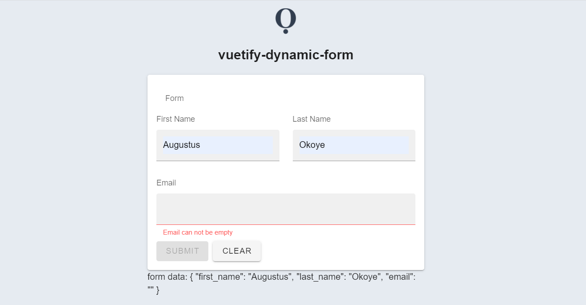

# vuetify-dynamic-form

Defining and creating form components and their validation can be tedious and repetitive. This form allows you to dynamically define form inputs with configurable options.




---

## :green_heart: Features
* Dynamically create form input fields
* Two-way binded form data. Useful when using forms in update context and the implementing component may update/provide the initial data
* Slots to customise field components
* Flexible configuration for validation, auto-grouping, component props, etc.

## Installation

```bash
npm i --save @moirei/vuetify-dynamic-form
# or yarn add @moirei/vuetify-dynamic-form
```


## Usage

```javascript
import Vue from 'vue'
import VDynamicForm from '@moirei/vuetify-dynamic-form'
import { VTextField } from 'vuetify/lib'
Vue.use(VDynamicForm)

new Vue({}).$mount('#app')

// then inside your vue components
export default Vue.extend({
  data: () => ({
    form: {},
    inputs: {
      first_name: {
        name: "First Name",
        rules: "required|max:24",
        type: "text",
        line: 1,
        props: {
          filled: true,
        },
      },
      last_name: {
        name: "Last Name",
        rules: "max:24",
        component: "v-text-field", // Use a compnent name
        line: 1,
        props: {
          filled: true,
        },
      },
      email: {
        name: "Email",
        rules: "required|email",
        component: VTextField, // Use a component
        props: {
          filled: true,
        },
      },
    },
  })
})

<template>
  <v-dynamic-form v-model="form" :input-fields="inputs" />
</template>
```


## API

### Props

| Name           | Required? | Default | Type      | Description                                                  |
| -------------- | --------- | ------- | --------- | ------------------------------------------------------------ |
| `value`        | yes       |         | `string`  | The `v-model` input prop                                     |
| `hide-name`    | no        | `false` | `boolean` | Whether to hide input name displayed above the component field |
| `loading`      | no        | `false` | `boolean` | Indicates the form or its data is in loading state. All inputs are disabled if true. |
| `readonly`     | no        | `false` | `boolean` | Sets all inputs to readonly                                  |
| `disabled`     | no        | `false` | `boolean` | Disables all inputs                                          |
| `hide-actions` | no        | `false` | `boolean` | Hides the **SUBMIT** and **CLEAR** actions                   |
| `defaults`     | no        | `{}`    | `object`  | Default form values to prepopulate the inputs with           |
| `input-fields` | yes       |         | `object`  | The dynamic form fields                                      |
| `valid`        | false     |         | `boolean` | Form validation state. Use with `valid.sync`.                |


### Field options

| Field          | Default | Type                 | Description                                                  |
| -------------- | ------- | -------------------- | ------------------------------------------------------------ |
| `name`         | Field key | `string`           | The input display name |
| `rules`        |         | `string`\|`array`    | [Vee-validate](https://vee-validate.logaretm.com) rules |
| `component`    |         | `string`\|`Component`|
| `type`         | Uses `<input >` tag if empty and `component` is also empty. | `string`             | Vuetify input types. Valid values: `text`, `select`, `checkbox`, `slider`, `range-slider`, `switch`, `textarea` and `radio`.|
| `props`        |  | `object`    | Input component props           |
| `mode` | `aggressive` | `string` | Vee-validate mode |
| `hideName`/`hide-name` | `false` | `boolean` | Hide the input display name |


### Events

| Name           | Description                                       |
| -------------- | ------------------------------------------------- |
| `input`        | The `v-model` input event                         |
| `submit`       | Emitted when the form is validated and submitted. |
| `update:valid` | The `valid.sync` prop event                       |


### Slots

| Name                       | Description                                                  | Props                           |
| -------------------------- | ------------------------------------------------------------ | ------------------------------- |
| `field:validation:{field}` | Use to override an input at the **validation-provider** level. | `{ field }`                     |
| `field:{field}`            | Use to override an input at the component level.             | `{ ...field, invalid, errors }` |
| `actions`                  | Use to override the default **SUBMIT** and **CLEAR** actions | `{ submit, clear, invalid }`    |


### Functions

| Name     | Description                                 |
| -------- | ------------------------------------------- |
| `submit` | Validates and emits `submit` event if valid |
| `clear`  | Resets the form data and validation states  |


### Classes

| Name                      | Description                             |
| ------------------------- | --------------------------------------- |
| `v-dynamic-form`          | The components class                    |
| `v-dynamic-form--inputs`  | The class group for all inputs          |
| `v-dynamic-form--actions` | The class group for the default actions |


## Contributing

Pull requests are welcome. For major changes, please open an issue first to discuss what you would like to change.


## Changelog

Please see [CHANGELOG](./CHANGELOG.md).


## Credits

* [Augustus Okoye](https://github.com/augustusnaz)


## License

[MIT](https://choosealicense.com/licenses/mit/)
